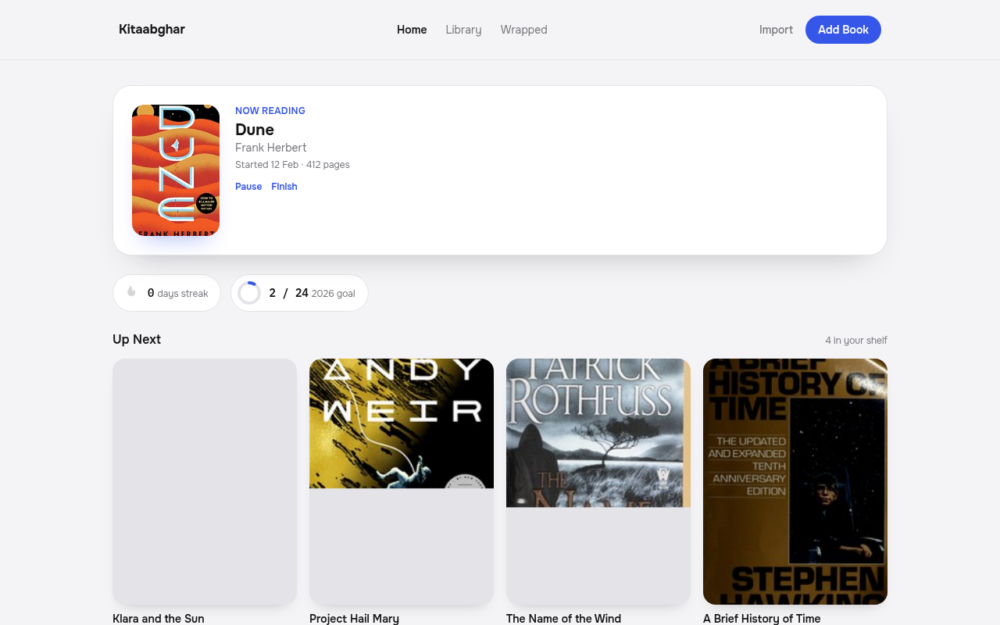
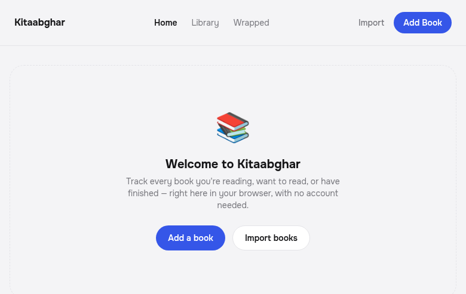
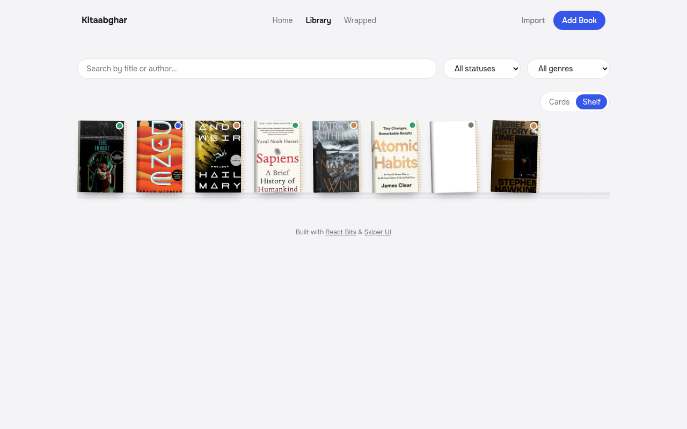
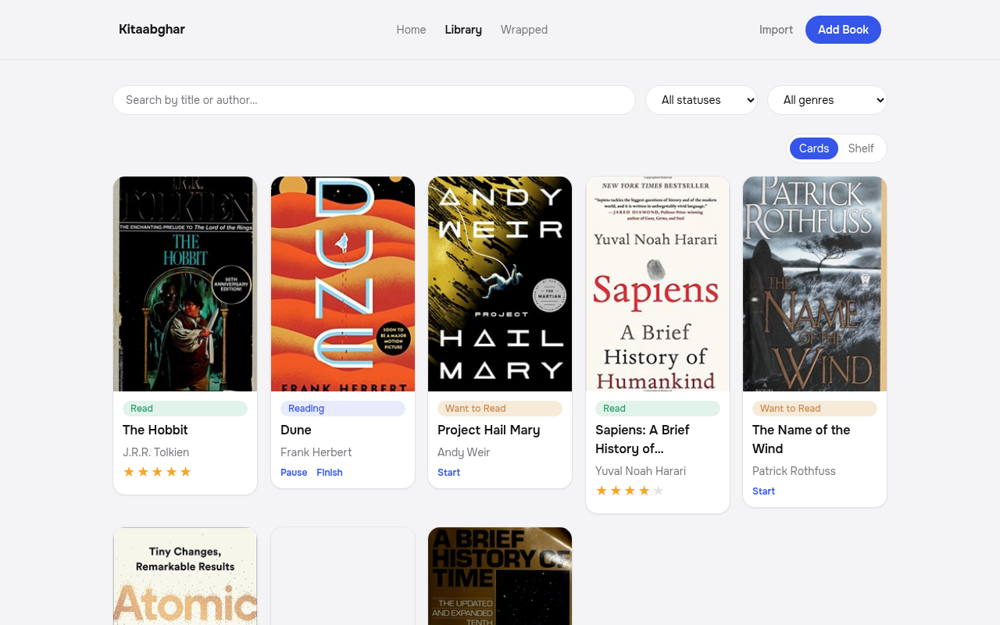
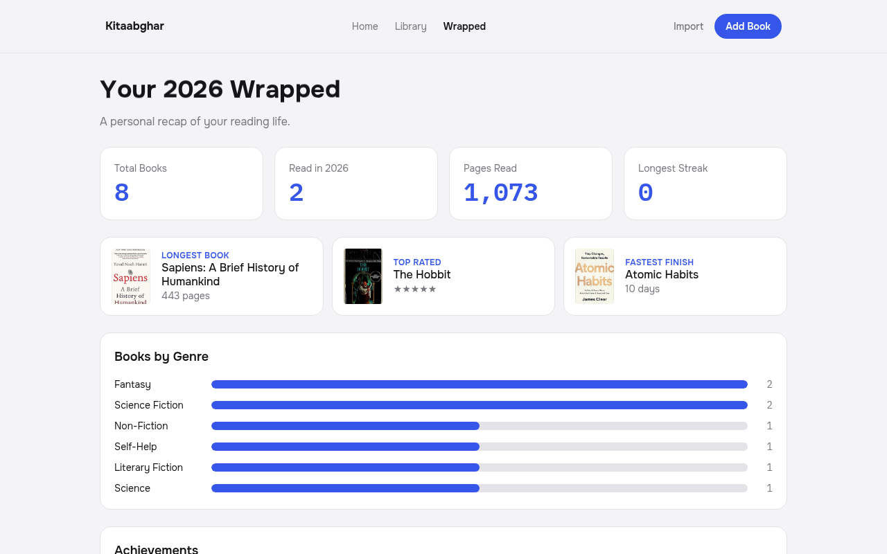

<div align="center">
  

  # Kitaabghar

  <strong>A local-first reading tracker with shelves, streaks, goals, and a Spotify-Wrapped-style year in review.</strong>
  <br />
  No accounts. No ads. No server. Your books, your browser.

  <br />

  [](https://gupta-ujjwal.github.io/kitaabghar/)

  <br />
  <br />

  [](https://github.com/gupta-ujjwal/kitaabghar/actions/workflows/deploy.yml)
  [](./LICENSE)
  [](https://react.dev/)
  [](https://www.typescriptlang.org/)
  [](https://tailwindcss.com/)
  [](./CONTRIBUTING.md)

  <p>
    <a href="#-features">Features</a> •
    <a href="#-screenshots">Screenshots</a> •
    <a href="#-getting-started">Getting Started</a> •
    <a href="#-tech-stack">Tech Stack</a> •
    <a href="#-contributing">Contributing</a>
  </p>
</div>

<br />

<p align="center">
  
</p>

## What is Kitaabghar?

**Kitaabghar** (किताबघर — "book house" in Hindi/Urdu) is for people who want
a Goodreads-style shelf without the social network, the ads, or the account
sign-up. Add the books you're reading, want to read, or have finished, move
them through your reading workflow with one click, and every year get a
personal "Wrapped" recap of what you read.

Everything lives in your browser's `localStorage` — there's no backend, no
tracking, and no sign-up. Clone it, run it, and it's yours.

## ✨ Features

|                            |                                                                                        |
| -------------------------- | -------------------------------------------------------------------------------------- |
| 🏠 **Home dashboard**       | See what you're currently reading, your daily streak, and your yearly goal at a glance |
| 🗂️ **Two library views**    | Browse as a card grid or a visual bookshelf, with search and filters                   |
| 🔁 **Status workflow**      | Want to Read → Reading → Paused/Read, one click, dates logged automatically            |
| ⭐ **Ratings & notes**       | Rate finished books out of five stars and keep private notes per book                  |
| 🎯 **Goals & streaks**      | Set an annual book goal and track a running daily activity streak                      |
| 🏆 **Achievements**         | Unlock badges for milestones — first finish, genre variety, reading streaks            |
| 🎁 **Wrapped**              | An end-of-year recap: pages read, top rated book, longest book, genre breakdown        |
| 📥 **Import / export**      | Bulk import books from JSON, export your whole library back out                        |
| 🔒 **Local-first**          | No accounts, no server — everything stays in your browser                              |

## 📸 Screenshots

<table>
  <tr>
    <td align="center" width="50%"><b>Getting started</b><br/></td>
    <td align="center" width="50%"><b>Library — Shelf view</b><br/></td>
  </tr>
  <tr>
    <td align="center" width="50%"><b>Library — Card view</b><br/></td>
    <td align="center" width="50%"><b>Wrapped — Year in review</b><br/></td>
  </tr>
</table>

## 🚀 Getting started

Requires Node.js 20+.

```bash
git clone https://github.com/gupta-ujjwal/kitaabghar.git
cd kitaabghar
npm install
npm run dev
```

The app will be available at `http://localhost:5173/kitaabghar/`.

<details>
<summary>Build, preview, and lint</summary>

```bash
npm run build    # tsc -b && vite build
npm run preview  # serve the production build locally
npm run lint     # oxlint
```

</details>

## 🛠️ Tech stack

[](https://react.dev/)
[](https://www.typescriptlang.org/)
[](https://vite.dev/)
[](https://tailwindcss.com/)
[](https://gsap.com/)

UI is composed with components from [React Bits](https://reactbits.dev) and
[Skiper UI](https://skiper-ui.com), on top of Tailwind CSS 4. Linting is
handled by [oxlint](https://oxc.rs/docs/guide/usage/linter.html).

## 📦 Deployment

Pushing to `main` triggers [`.github/workflows/deploy.yml`](.github/workflows/deploy.yml),
which builds the app and publishes it to GitHub Pages. To deploy your own
fork, enable Pages under **Settings → Pages → Source: GitHub Actions**.

## 🤝 Contributing

Contributions are welcome, big or small! See [CONTRIBUTING.md](./CONTRIBUTING.md)
for setup steps, coding conventions, and PR expectations, and please follow
our [Code of Conduct](./CODE_OF_CONDUCT.md).

Found a bug or have a feature idea? [Open an issue](https://github.com/gupta-ujjwal/kitaabghar/issues).

## 📄 License

Kitaabghar is [MIT licensed](./LICENSE).
